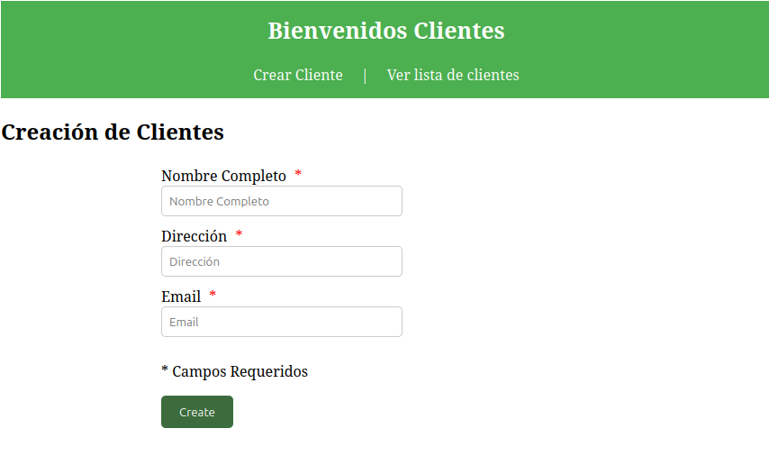
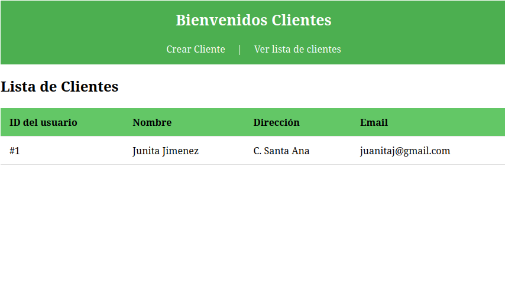

# Proyecto de Gestión de Clientes con Angular

Este proyecto es una aplicación sencilla desarrollada en **Angular** que permite crear y listar clientes de manera local, con almacenamiento temporal en un array. Está pensado como un ejemplo práctico para manejar módulos, componentes, servicios e interfaces en Angular.


**Figura 1: Formulario para la creación de clientes**


**Figura 2: Tabla con la lista de clientes creados**

---

## Características principales

* **Módulo Clientes**

  * `clientes/crear-cliente`: formulario con validaciones para añadir un nuevo cliente.

    * Campos obligatorios: **Nombre completo**, **Dirección** y **Email**.
  * `clientes/lista-de-clientes`: tabla donde se muestran los clientes añadidos, incluyendo su **ID asignado**, **Nombre completo**, **Dirección** y **Email**.

* **Interfaz Cliente**
  Define el modelo de datos con los campos:

  ```ts
  id: number;
  nombre: string;
  direccion: string;
  email: string;
  ```

* **Servicio de Clientes**

  * Se encarga de **crear** y **listar** los clientes.
  * Los datos se almacenan de forma **local** en un array temporal.

* **Diseño CSS**
  Cada componente cuenta con estilos básicos para una mejor visualización.

* **Pruebas unitarias**
  Se incluye una prueba en el servicio que verifica que un cliente se cree correctamente.

---

## 📂 Estructura principal del proyecto

```
src/app/
 └── clientes-modulo/
      ├── crear-cliente/
      │    └── crear-cliente.component.ts|html|css
      ├── lista-de-clientes/
      │    └── lista-de-clientes.component.ts|html|css
      ├── clientes.modulo.module.ts
      ├── cliente.model.ts (interfaz)
      └── clientes.servicio.ts
```

---

## Ejecución del proyecto

1. **Clonar el repositorio**

   ```bash
   git clone https://github.com/mina-45b/clientes.git
   cd clientes
   ```

2. **Instalar dependencias**

   ```bash
   npm install
   ```

3. **Ejecutar en desarrollo**

   ```bash
   ng serve
   ```

   Luego abrir en tu navegador: **[http://localhost:4200](http://localhost:4200)**

---

## Pruebas unitarias

Ejecutar los tests con jasmine el siguiente comando:

```bash
ng test
```

Esto ejecutará las pruebas configuradas en el servicio de clientes para comprobar que se crean correctamente.

